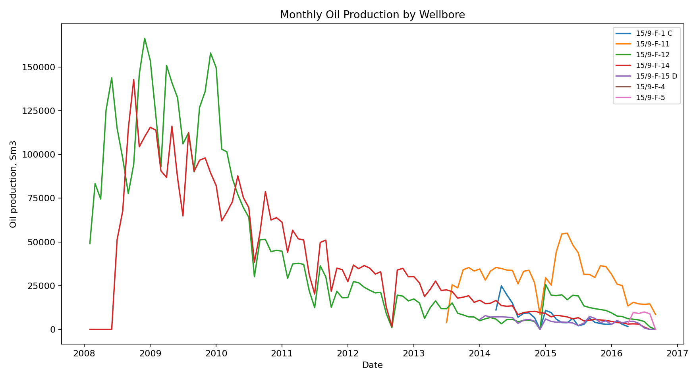
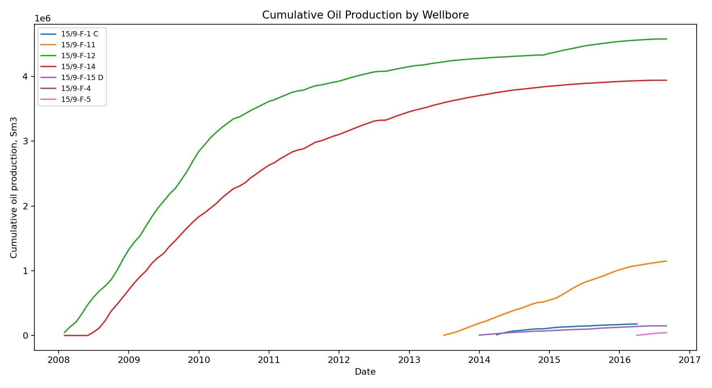
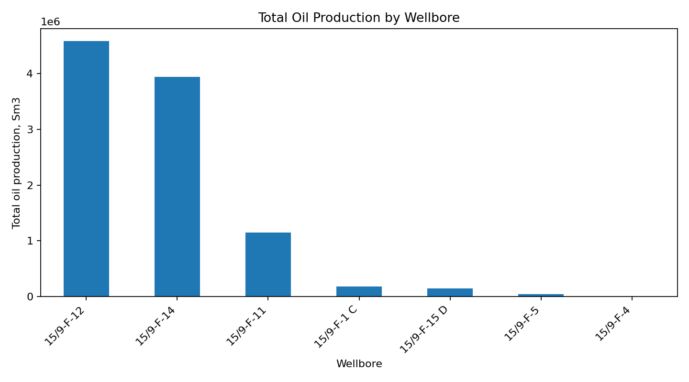
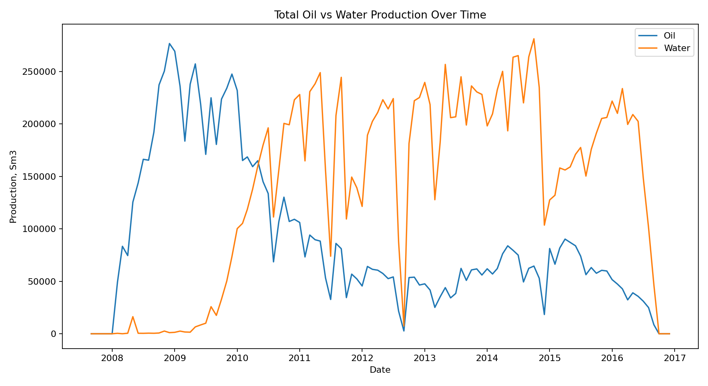
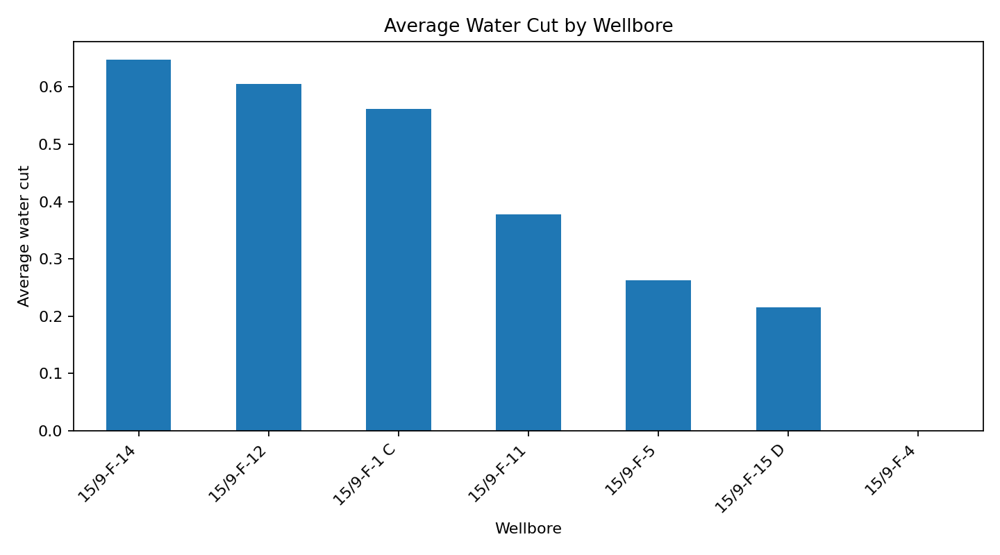

# Volve Field Decline Curve Analysis

Petroleum engineering project analyzing real Volve field well-production data using Python, SQL, Pandas, NumPy, Matplotlib, and decline curve analysis.

## Dataset

Dataset: Volve production data.

The project uses monthly well-production data, including oil, gas, water, injection, and on-stream information.

## Project Goals

- Clean real well-production data
- Analyze oil production behavior by wellbore
- Perform decline curve analysis
- Estimate monthly and annual decline rates
- Visualize actual vs fitted oil production
- Create SQL-based well production summaries
- Summarize findings in a technical report

## Methodology

This project applies exponential decline curve analysis:

    q(t) = qi * exp(-D * t)

Where:

- q(t): oil production at time t
- qi: estimated initial production rate
- D: decline rate
- t: time in months

## Tech Stack

Python, SQL, SQLite, Pandas, NumPy, Matplotlib, scikit-learn, Excel, Git, GitHub

## How to Run

Install dependencies:

    pip install -r requirements.txt

Clean the data:

    python src/clean_data.py

Run SQL analysis:

    python src/run_sql_analysis.py

Run decline curve analysis:

    python src/decline_curve.py

## Outputs

- Cleaned monthly production dataset
- SQL-based well production summaries
- Decline curve results table
- Actual vs fitted oil production plots
- Detailed technical report
## Visualizations and Interpretation

### Monthly Oil Production by Wellbore

This figure shows monthly oil production trends for each wellbore. It helps compare production behavior over time and identify wells with stronger production performance, unstable output, or clear decline patterns.

### Cumulative Oil Production by Wellbore

This plot shows cumulative oil production for each wellbore. Wells with steeper cumulative curves contributed more total oil production, while flatter curves indicate lower or declining contribution.

### Total Oil Production by Wellbore

This bar chart compares total oil production across wellbores. It identifies the main producing wells and highlights which wellbores had the largest contribution to total field production.

### Oil vs Water Production Over Time

This figure compares total oil and water production over time. Increasing water production relative to oil may indicate reservoir maturity, water breakthrough, or changing production conditions.

### Average Water Cut by Wellbore

This chart shows average water cut by wellbore. Higher water cut values suggest that a larger share of produced fluids is water, which can be important for evaluating well performance and production efficiency.

### Decline Curve Analysis

Decline curve plots compare actual oil production with the fitted exponential decline model for selected wellbores.

These plots help evaluate how well a simple exponential decline model represents post-peak production behavior. A close match between actual and fitted curves suggests a more stable decline trend, while large deviations may indicate operational changes, shut-ins, production interruptions, or reservoir complexity.## Project Structure

    data/
      raw/
      processed/
    src/
      clean_data.py
      run_sql_analysis.py
      decline_curve.py
    sql/
      well_production_summary.sql
      yearly_well_production.sql
    reports/
      figures/
      sql_results/
      decline_curve_results.csv
      technical_report.md
    requirements.txt
    README.md

## Technical Report

The detailed technical report is available here:

    reports/technical_report.md

## Portfolio Value

This project demonstrates petroleum production analytics, decline curve fitting, SQL-based production aggregation, visualization, and technical reporting using real well-production data.
